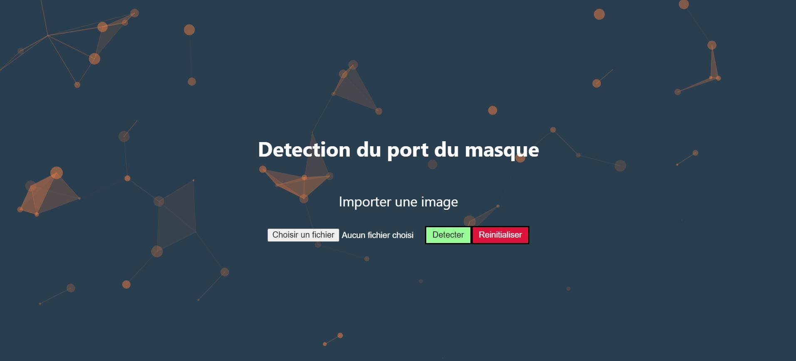

<h1 align="center">Projet API Machine Learning</h1>

<div align= "center">
  <p>Les objectifs de ce projet sont multiples. Créer un modele de Machine Learning de detection des masques puis créer une API pour fournir une application déployée sur le web</p>
</div>

&nbsp;
 [](https://www.linkedin.com/in/bastien-angeloz-204360a4/)

&nbsp;
[Check Live Demo](https://detector-c4vf3ncwrq-oa.a.run.app/)

## :point_down: Let's Go ! 2 possibilités :

#### 1 :star: Suivre le tutoriel pas à pas pour construire l'application
#### 2 :star: Cloner le repo 
Pour **l'option 2**, cloner le repo puis effectuer les commandes suivantes dans les dossiers respectifs:
###### Front
```
npm install
```
###### Back
```
virtualenv .venv
.venv\\Scripts\\activate
pip install -r requirements.txt
```

Après cela, reprener à l'étape **BUILD ET DEPLOIEMENT** sans oublier de changer les **credentials** de votre projet GCP.

---

## :key: Prerequisites

###### Languages
[Python](https://www.python.org/downloads/release/python-3109)
[Node.js](https://nodejs.org/en/download/)
###### Framework
[React](https://fr.reactjs.org/)
[Flask](https://flask.palletsprojects.com/en/2.2.x/)

**Verification des installations**
```
node -v
npm -v
python --version
```

## :warning: Stack technique | Framework & Libs

##### Machine Learning
- [OpenCV](https://opencv.org/)
- [Caffe-based face detector](https://caffe.berkeleyvision.org/)
- [Keras](https://keras.io/)
- [TensorFlow](https://www.tensorflow.org/)
- [MobileNetV2](https://arxiv.org/abs/1801.04381)

##### Dev
- [Flask](https://flask.palletsprojects.com/en/2.2.x/)
- [React](https://fr.reactjs.org/)
- [Gunicorn](https://gunicorn.org/)

## :file_folder: Dataset
Le Dataset utilisé pour le CNN du modèle: [Telecharger](https://github.com/chandrikadeb7/Face-Mask-Detection/tree/master/dataset)

Le dataset contien __4095 images__ divisé en deux classes:
*	__with_mask: 2165 images__
*	__without_mask: 1930 images__
_________________

# 🚀&nbsp; Step by step


#### Nouveau projet

Créer un dossier sur votre bureau intitulé **`votre_dossier`** puis incorporer le dans VSCODE.
Ouvrez un terminal et placer votre dans dossier
```
cd [votre_dossier]
```
### :star: Frontend

#### Créer une application React
https://reactjs.org/docs/create-a-new-react-app.html
```
npx create-react-app my-app
```

#### Checker votre front
```
cd my-app
npm start
```
Verifier le bon fonctionnement en local sur le port:
http://localhost:3000/

Dans le dossier **votre_dossier/my-app/src** vous trouverez le fichier ***App.js*** ou nous integrerons l'API et le fichier **App.css** pour le style.
Dans le dossier **my-app** vous trouverez le fichier **package.json** qui est le fichier de dependance pour javascript.

***Vous pouvez recuperer le code JavaScript dans le fichier App.js disponible dans le repo***
Si vous savez coder en JS, vous pouvez aussi créer votre propre page.

### :star: Backend

#### Construire le backend

Resituer vous dans dossier racine 
```
cd [votre_dossier]
```
Créer un nouveau dossier nommé **back**
A l'interieur de ce dossier créer un fichier **model.py**.
A l'interieur de ce dossier, créer un dossier `model` et ajouter y vos fichiers necessaire au modele. pour ma part ce sont ces fichiers: `deploy.prototxt`, `mask_detector.model`, `res10_300x300_ssd_iter_140000.caffemodel`.
***C'est dans ce dossier que vous irez recuperer vos fichier necessaire au traitement de votre model.***

Situer ou dans votre backend, créer un environnement virtuel et activer le:
```
cd back
# windows command
virtualenv .venv
.venv\\Scripts\\activate
```

#### Installer les dependances backend

Installer les dependances necessaires aux traitements et aux processing de votre application.

```
pip install -r requirements.txt
```

#### Création du fichier python integrant l'API

Dans votre dossier racine **votre_dossier**, créer un fichier api.py.
Ce sera notre application Flask et notre **point de communication** entre le front et le back.

Vous pouvez copier ce fichier api.py si necessaire en remplacant si besoin la methode employé par le modele par la methode que vous aurez créer dans votre fichier model.py.

#### Réglage de l'environnement Flask

créer un fichier dans le dossier racine nommé **.flaskenv** et copier ceci à l'interieur
```
FLASK_APP=api.py
FLASK_ENV=development
```

#### Lancement du serveur Flask
```
flask run
```

Vous avez maintenant un server qui tourne sur le port:
http://localhost:5000/

### :star: Liaison front-back

#### Liaison serveur proxy

Nos deux parties front et back tourne sur des port différents: 3000 et 5000.
Nous devons donc les liers.
Incorporer un nouveau reglage dans le package.json du dossier **my-app**
```
{
    "proxy": "http://localhost:5000/",
}
```

### :star: Création de l'API
###### Frontend
Il faut coder 3 fonctionnalités principales:
- Un bouton pour importer une image à partir de l'ordinateur
- Une fonction pour envoyer cette image au back
- La recupération de l'image sur le Cloud Storage Google

**Vous pouvez recuperer le morceau de code correspondant dans le fichier App.js**
Pour ceux qui souhaite coté le JS eux même, n'hésitez pas !!

###### Backend
Il faut coder 3 fonctionnalités principales:
- La reception de l'image via l'API
- Le passage de l'image dans le modele de ML
- L'envoi de l'image sur le Cloud Storage Google

**Vous pouvez regarder les class MaskDetector et SaveData dans le fichier model.py**

## :star: Intégration de GCP & Firebase
Pour stocker vos données sur le cloud via les API GCP, vous devez créer un nouveau projet web **Firebase**.
La documentation est disponible [ici](https://firebase.google.com/docs).

**Il faudra ensuite incorporer les credentials dans votre projet**
- coté front-end (car nous avons une requete pour récupérer l'image sur le cloud)
- coté back (car nous avons une méthode pour sauvgarder une image sur le cloud après traitement par le modele de ML)

###### Frontend
Créer un fichier `firebase-config.json` dans le dossier `my-app` et integrer le SDK créer par firebase. Pour cela, aller dans paramètre du projet sur votre projet firebase.

Pour appeler les API Firebase dans votre code coté front, vous devrez installer firebase dans le package.json
```
npm i firebase
```

###### Backend
Créer une **clef de service JSON** de votre projet à partir de GCP. Pour cela, à partir de GCP, aller dans IAM et Service puis compte de service.
Créer une clef JSON pour votre compte et intégrer la dans votre projet.
Vous pouvez placer les informations utiles dans des **variables d'environnement** pour plus de sécurité.

Pour appeler les **API GCP** dans votre code coté back, vous devrez installer la dependance suivante:
```
pip install google-cloud
```

Profitez en pour installer les dependances suivantes qui nous serviront plus tard pour les reglages de notre application coté cloud
```
pip install gcloud
pip install gsutil
```

Vous pouvez maintenant coder l'ecriture des images post-traitement pour les envoyer dans **le bucket** disponible sur votre compte GCP Storage.

## :star: Local Test

Lancer les serveurs en local et essayer d'importer une image et de la traiter.
```
npm start
flask run
```
Si il y a des erreurs, vous pouvez debug rapidement:
- coté front: en ouvrant la console du navigateur
- coté back: en observant le terminal et le DEBUG de Flask

## :star: Build & Deploiement

###### Build dossier static

Avant de lancer le build:
- Dans le fichier .flaskenv, passer la valeur de 'developement' à 'production'.
- Supprimer la ligne proxy du package.json que nous avions ajouter pour le developpement local.

Il faut maintenant construire un fichier static puis integrer le chemin à l'application Flask.
depuis **my-app**, executer:
```
npm run build
```
Cela vous construira un doisser `build` dans **my-app**


###### Ressource
- [Step-by-Step Firebase](https://firebase.google.com/docs/hosting/cloud-run)


Pour pouvoir déployer sur GCP, il faut build l'application en utilisant Cloud Run.
Pour cela, nous construisons un fichier `Dockerfile` qui est un **file conducteur avec les reglages necessaire pour construire l'image**.
Vous pouvez recupérer ce fichier et l'dapté à votre structure de dossier.
Si **votre structure** et **vos dependances** sont identiques à la mienne, vous pouvez utiliser les mêmes reglages

Pour commencer le build, utiliser:
```
gcloud builds submit --tag gcr.io/<PROJECT_ID>/<NAME_PROJECT_IMAGE>
```
ps: <NAME_PROJECT_IMAGE> sera le nom de votre image et doit être en minuscule uniquement.

Si votre build réussis, un message **SUCCES** apparaitra et votre image sera disponible dans **REGISTER CONTAINER** sur votre projet GCP.

###### Deploiement

```
gcloud run deploy --image gcr.io/PROJECT_ID/<NAME_PROJECT_IMAGE>
```
ps: <PROJECT_ID> et <NAME_PROJECT_IMAGE> doivent être en minuscule.
Si GCP ne trouve pas l'image, vous pouvez copier directmeent le chemin de votre image depuis **REGISTER CONTAINER** et effectuer la commande suivante
```
gcloud run deploy --image <chemin_copié_depuis_GCP>
```
Lors du deploiement, répondre aux question:
- Confirmer le nom de service = nom de l'image
- Selectionner une region = Selectionner la region souhaité pour l'hebergement
- Authoriser les appels non authentifiés ? = Y

Si le deploiement est une reussite, vous aurez un **SERVICE URL** dans le terminal ou votre application est executée.

###### Variables envrionnements

Si vous utiliser des variables d'environnement, il faudra les definir pour que l'application puisse y acceder.
**Aller sur GCP > Cloud Run > Modifier le service > ADD VARIABLE et rentrer les pairs KEY:VALUE**.

###### Debug
Vous pourriez avoir quelques soucis lors des requetes dans l'application, si c'est le cas:
- Verifier vos reglages et autorisation CORS. Si besoin, changer les reglages CORS du bucket.
- Acceder aux journaux de l'application dans Cloud Run pour Debug

## :star: Credentials

Ce projet est public. Si vous souhaitez securiser l'accàs à votre API et des requetes, utiliser **SECRET MANAGE** de GCP. Pour Cela, rendez vous dans **SECRET API** pour activer la fonctionnalité. Vous pouvez ensuite incorporer vos **SECRET** pour sécuriser l'application.


---

## :email: Contact
Vous pouvez m'ecrire à bastien.angeloz@gmail.com

---

## 👏 Credits & Remerciement

- https://github.com/chandrikadeb7/Face-Mask-Detection
- https://www.pyimagesearch.com/
- https://www.tensorflow.org/tutorials/images/transfer_learning
- https://github.com/chandrikadeb7
---
## 👀 Licence
MIT


